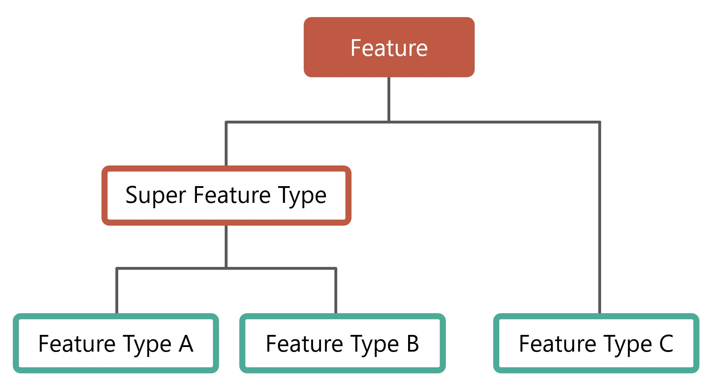
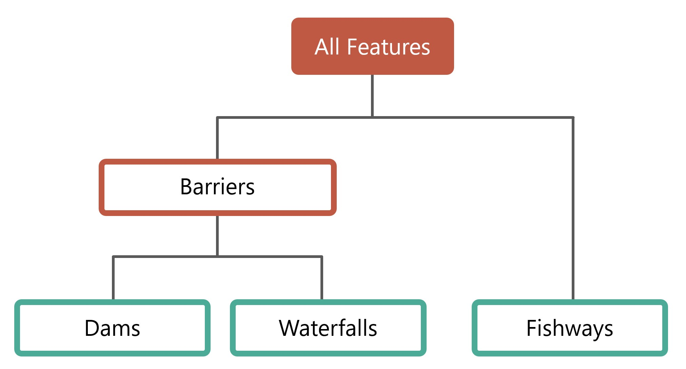

..
    Raw html added to assign styling only to codeblocks being used as headers in this document

.. raw:: html

    

.. role:: codeblocksize

.. _application-architecture:

Architecture de l'application
#############################

Cette section contient des renseignements techniques sur la mise en œuvre actuelle de l’application dorsale de la Base de données sur les obstacles aquatiques du Canada (BDOAC), y compris les services d’éléments et de tuiles vectorielles ainsi que le dictionnaire de données de la BDOAC. Le public cible est composé des développeurs de logiciels et des utilisateurs techniques similaires qui cherchent à mettre à niveau ou à maintenir le système actuel ou à utiliser les points de fin API.

.. _current-application-architecture:

Mise en œuvre actuelle
**********************

-----

L’application actuelle repose sur deux serveurs d’applications Web Java Microsoft Azure, ``cabd-web`` (pour les données BDOAC) et ``chyf-web`` (pour les données CHyF).

.. image:: img/app-arch3.jpg
    :align: center

.. _cabd-feature-model:

.. _cabd-models:

Éléments et modèles de base de données
**************************************

-----

Modèle d’élément BDOAC
======================

.. _generic-feature-model:

Modèle d’élément générique
--------------------------

Les éléments dans la BDOAC ont une structure hiérarchique facultative. Il est possible de combiner les types d’éléments pour former des supertypes.

Il n’y a pas de structure dans le logiciel ou la base de données qui appliquent ce modèle. On utilise les vues de la base de données (voir section ci-dessous) pour définir les différents types et supertypes d’éléments. Au besoin, il est possible d’associer un type d’éléments à plusieurs supertypes.

.. _implemented-feature-model:

Modèle d’élément mis en œuvre
-----------------------------

Trois types d’éléments et un supertype sont actuellement mis en œuvre dans la BDOAC.

Types d’éléments :

- ``barriers`` - un supertype d’élément qui comprend des barrages, des chutes et d’autres structures.
- ``dams`` - un type couvrant les éléments classés comme barrage ou autre structure.
- ``waterfalls`` - un type couvrant les éléments classés comme chute.
- ``fishways`` - un type couvrant les éléments classés comme passe à poissons.
- ``medium`` - un type d’élément que l’on a créé pour tester l’augmentation du volume de données prévue en ce qui a trait aux données relatives aux franchissements de cours d’eau.
- ``big`` - un type d’élément que l’on a créé pour tester l’augmentation du volume de données prévue en ce qui a trait aux données relatives aux franchissements de cours d’eau.

.. _cabd-database-model:

Modèle de base de données BDOAC
===============================

La base de données est structurée en plusieurs schémas. Chaque type d’élément a son propre schéma, avec un schéma BDOAC commun pour les données transmises et les métadonnées des éléments.

.. _cabd-feature-views:

Vues des éléments
-----------------

Chaque type et supertype d’élément a deux vues qui prennent en charge l’API – une pour l’anglais (_en) et une pour le français (_fr). Ces vues devraient inclure tous les champs requis pour l’édition (pour l’affichage dans l’interface utilisateur ou pour prendre en charge la future API d’édition).

La vue  prend en charge tous les points de fin de l’API des éléments.

|enfr| 

On utilise les vues pour la prise en charge des API de la BDOAC qui répertorient les éléments. Chaque type d’élément est lié à une vue de la base de données. Lors de la demande d’éléments d’un type particulier, la vue associée à ce type est interrogée. On utilise les champs récupérés au moyen de cette vue pour saisir les attributs de l’élément récupéré au moyen de l’API. Les vues de type d’élément interrogent généralement un seul tableau de données (par exemple, la vue des  ``dams`` interroge le tableau de données des barrages). Les supertypes d’éléments interrogent généralement plusieurs tableaux de données (par exemple, la vue des ``barriers`` interroge le tableau de données des barrages et celui des chutes).

.. _cabd-feature-update-view:

Vue de mise à jour des éléments
-------------------------------

Chaque élément comprend un attribut ``updates_pending`` indiquant une valeur ``true`` ou ``false`` indiquant s’il y a des mises à jour d’élément en attente d’examen dans le système. Le système remplit ce champ au moyen de la vue ``cabd.updates_pending``. Cette vue devrait afficher une seule colonne, ``cabd_id``, pour chaque élément pour lequel il y a un examen en attente dans la base de données.

.. _core-tables:

Tableaux de base
----------------

Il s’agit des tableaux de base du système. Ils sont requis, quels que soient les types d’éléments chargés. Ils prennent en charge la définition des types d’éléments.

:codeblocksize:`cabd.feature_types`

Indique tous les types d’éléments pris en charge par le système.

.. csv-table:: 
    :file: tbl/core-tables.csv
    :widths: 30, 70
    :header-rows: 1

:codeblocksize:`cabd.feature_type_metadata`

Indique tous les attributs pour une vue d’éléments donnée ainsi que des renseignements détaillés sur les métadonnées de l’attribut.

.. csv-table:: 
    :file: tbl/feature-type-metadata.csv
    :widths: 30, 70
    :header-rows: 1

:codeblocksize:`cabd.data_source`

Indique les sources des données. Prend en charge le suivi des sources des données pour les attributs des types d’éléments.

.. csv-table:: 
    :file: tbl/data-source.csv
    :widths: 30, 70
    :header-rows: 1

.. _shared-attribute-tables:

:codeblocksize:`cabd.contacts`

Une liste de personnes-ressources pertinentes pour la base de données BDOAC. Actuellement, les personnes-ressources ne sont créées que lorsqu’un utilisateur soumet une mise à jour d’élément.

.. csv-table:: 
    :file: tbl/contacts.csv
    :widths: 30, 70
    :header-rows: 1

:codeblocksize:`cabd.user_feature_updates`

Les utilisateurs peuvent utiliser l’API des éléments pour soumettre des mises à jour d’élément. Toutes les soumissions sont consignées dans ce tableau.

.. csv-table:: 
    :file: tbl/user_feature_updates.csv
    :widths: 30, 70
    :header-rows: 1
    
        
Tableaux d’attributs communs
----------------------------

Tous ces tableaux stockent des données communes à plusieurs types d’éléments. En général, chacun de ces tableaux a un code unique (pour les références), un nom et une description.

* ``cabd.barrier_ownership_type_codes``
* ``cabd.fish_species``
* ``cabd.nhn_workunit``
* ``cabd.passability_status_codes``
* ``cabd.province_territory_codes``
* ``cabd.upstream_passage_type_codes``
* ``cabd.census_subdivisions``

.. _feature-tables:

Tableaux d’éléments
-------------------

Les tableaux de données des types d’éléments se trouvent dans le schéma correspondant. En général, il y a un tableau de données d’éléments et plusieurs tableaux de référence qui représentent les valeurs d’attributs. Le dictionnaire de données contient des renseignements détaillés sur les types d’éléments actuels.

.. _feature-type-attribute-data-sources:

Sources des données des attributs des types d’éléments
------------------------------------------------------

La base de données BDOAC offre la possibilité de consigner la source de données pour chaque attribut associé au type d’élément. À cette fin, on a mis en place des tableaux ``<featuretype>.<featuretype>_feature_source`` et ``<featuretype>.<featuretype>_attribute_source`` pour le type d’élément (par exemple, ``dams.dams_feature_source`` et ``dams.dams_attribute_source``).

Pour chaque élément BDOAC, le tableau ``<featuretype>_feature_source``  contient un lien vers les sources des données ainsi que les identifiants des éléments de la source de données connexe dans laquelle l’élément a été trouvé. Par exemple, un barrage trouvé à la fois dans les sources des données nrcan_canvec_mm et bceccs_fiss aura deux entrées pour sa valeur ``cabd_id`` dans le tableau ``<featuretype>_feature_source``.

:codeblocksize:`<featuretype>_feature_source`

.. csv-table:: 
    :file: tbl/feature-source.csv
    :widths: 30, 70
    :header-rows: 1

Le tableau ``<featuretype>_attribute_source`` contient la valeur`` cabd_id`` ainsi qu’une colonne pour chaque attribut nécessitant un suivi de la source des données. La colonne ``<attribute>_ds`` renvoie au tableau ``cabd.data_source`` à des fins de détermination de la source de données pour la valeur de l’attribut.

:codeblocksize:`<featuretype>_attribute_source`

.. csv-table:: 
    :file: tbl/feature-attribute.csv
    :widths: 30, 70
    :header-rows: 1

.. _audit_log:
    
Journal d’audit et suivi des modifications
------------------------------------------

La base de données BDOAC effectue le suivi des modifications aux tableaux suivants :

* ``cabd.contacts``
* ``cabd.fish_species``
* ``cabd.data_source``
* ``dams.dams``
* ``dams.dams_attribute_source``
* ``dams.dams_feature_source``
* ``waterfalls.waterfalls``
* ``waterfalls.waterfalls_attribute_source``
* ``waterfalls.waterfalls_feature_source``
* ``fishways.fishways``
* ``fishways.fishways_attribute_source``
* ``fishways.fishways_feature_source``
* ``fishways.species_mapping``

On peut aussi ajouter le suivi des modifications aux nouveaux types d’éléments en appliquant les déclencheurs appropriés à tout nouveau tableau de bases de données pertinent.

Toutes les modifications sont consignées dans le tableau ``cabd.audit_log``. Ce tableau comporte les colonnes suivantes :

.. csv-table:: 
    :file: tbl/audit_log_table.csv
    :widths: 30, 70
    :header-rows: 1
    
