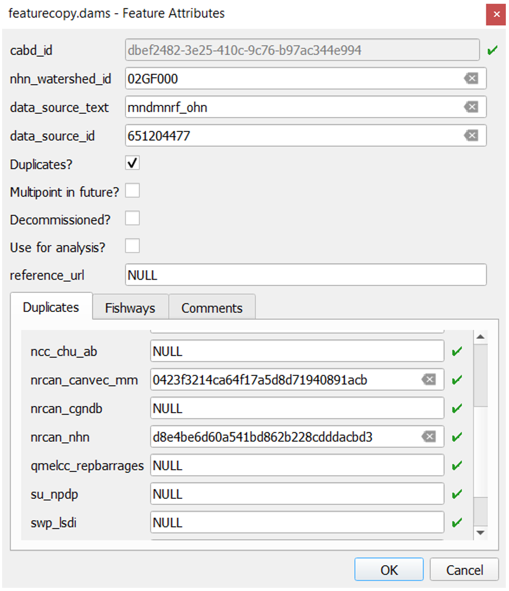
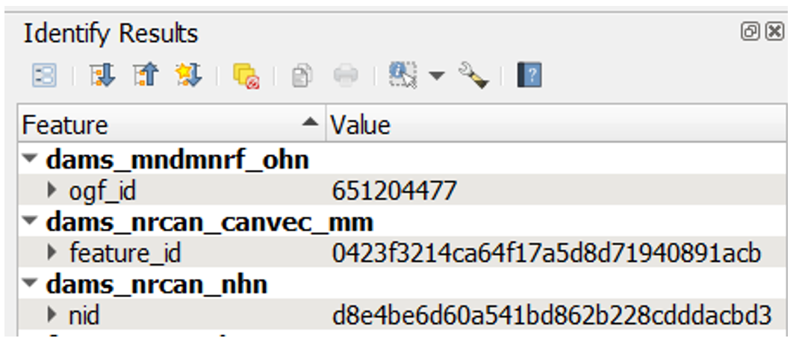

.. _reviewmethods:

=================================
Méthodes de traitement de données
=================================

Les données de la Base de données sur les obstacles aquatiques du Canada (BDOAC) ont été compilées à partir de différents jeux de données spatiales et non spatiales. La présente section offre un aperçu des méthodes utilisées pour la validation, la déduplication et la normalisation des jeux de données spatiales existants afin qu’ils correspondent à la structure des données de la BDOAC.

.. admonition:: Remarque

    Dans la BDOAC, on utilise le terme « élément » pour désigner une structure individuelle qui représente un barrage, une chute ou une passe à poissons. Dans la présente section, on utilise le terme « point d’élément » pour désigner l’emplacement géographique d’un élément.

Repérage et suivi des doublons
------------------------------

Génération de la couche d’examen
~~~~~~~~~~~~~~~~~~~~~~~~~~~~~~~~

La première étape du processus consiste à générer une couche d’examen qui enregistre les points potentiellement dupliqués à partir des jeux de données sources. Les renseignements de cette couche d’examen font ensuite l’objet d’un examen manuel.

Les entrées de la couche d’examen incluent une zone d’intérêt prédéfinie et un ensemble de jeux de données sources pour la zone d’intérêt – idéalement, il devrait s’agir exclusivement de jeux de données sources connus et accessibles au public. Une fois que l’on a déterminé le jeu de données source comportant le plus grand nombre de points d’élément au sein de la zone d’intérêt, on extrait les points d’élément de ce jeu de données pour former la base de la couche de départ.

On met en mémoire tampon la couche de départ afin de déterminer la distance tampon la plus appropriée qui contient la majorité des points d’élément des autres jeux de données sources représentant les mêmes structures (c.-à-d. les doublons) et disjoint ceux qui représentent des structures différentes (c.-à-d. les non-doublons). Cette distance tampon est généralement de 50 à 100 m.

Ensuite, on utilise l’outil Join attributes by nearest dans QGIS pour joindre les identifiants uniques d’un deuxième jeu de données source aux éléments de la couche de départ, en fonction de la tolérance déterminée. Le résultat est une nouvelle version de la couche d’examen avec un champ supplémentaire dans le tableau des attributs qui contient l’identifiant unique de chaque doublon présumé du deuxième jeu de données source. On répète le processus pour chaque jeu de données source restant, en utilisant la sortie générée dans chaque cas comme couche d’entrée pour la jointure suivante.

Une fois le processus terminé pour chaque jeu de données, on sélectionne les points d’élément de chaque jeu de données source en dehors de la tolérance déterminée, mais à l’intérieur de la zone d’intérêt, et on répète l’ensemble du processus avec une nouvelle couche de départ, en commençant par le jeu de données source qui a le plus grand nombre d’éléments sélectionnés.

Une fois que la plupart des éléments de jeu de données source ont été saisis, on fusionne toutes les couches de sortie pour créer la version finale de la couche d’examen. Pour faciliter le processus de révision, on ajoute aussi à ce stade quelques champs à la couche de révision de façon à assurer le suivi de renseignements supplémentaires sur les éléments, et on crée un formulaire d’affichage d’attributs personnalisé dans QGIS. Une fois cette couche de révision finale terminée, on la charge dans une base de données PostgreSQL avec l’extension PostGIS pour permettre aux réviseurs de travailler simultanément à la vérification de l’emplacement et des renseignements des points d’élément.

Vérification de l’emplacement des structures au moyen de l’imagerie satellitaire
~~~~~~~~~~~~~~~~~~~~~~~~~~~~~~~~~~~~~~~~~~~~~~~~~~~~~~~~~~~~~~~~~~~~~~~~~~~~~~~~

La première étape de la vérification des points d’élément dans la couche de révision consiste à confirmer que le point d’élément se trouve au bon emplacement. Pour ce faire, l’évaluateur examinera la position du point d’élément par rapport à l’emplacement de la structure correspondante dans l’imagerie satellite, si elle est visible. Si une structure n’est pas visible dans l’image satellite, l’examinateur vérifiera les renseignements sur la structure disponibles dans les jeux de données sources ou effectuera des recherches en ligne pour confirmer l’emplacement de la structure, déterminer si elle a été retirée ou mise hors service, et relocaliser le point d’élément, au besoin.

Si la structure n’a pas été mise hors service, l’examinateur évaluera ensuite l’emplacement du point d’élément par rapport au réseau hydrographique. Si le point d’élément est situé à plus de 50 m du trajet d’écoulement de réseau hydrographique le plus proche et que l’on croit qu’il bloque l’écoulement, l’examinateur déplacera le point d’élément à l’endroit où la structure croise le trajet d’écoulement (voir la section ‘:ref:`Relier ou ne pas relier <snapping>`’).

À moins que les jeux de données sources ou les recherches supplémentaires indiquent qu’une structure a été retirée, on suppose que toutes les structures des jeux de données sources sont en place. Par conséquent, si un examinateur n’est pas en mesure de confirmer si une structure est en place ou où elle est située, on laisse le point d’élément à son emplacement d’origine indiqué dans le jeu de données source.

Vérification des points d’élément en double dans la couche de révision
~~~~~~~~~~~~~~~~~~~~~~~~~~~~~~~~~~~~~~~~~~~~~~~~~~~~~~~~~~~~~~~~~~~~~~

Bien que l’on utilise le processus semi-automatique de génération de la couche de révision pour saisir rapidement la plupart des identifiants en double, on ne s’attend pas à ce que ce processus produise un résultat parfait. Par conséquent, pour chaque point d’élément, il faut effectuer un examen manuel afin de vérifier que tous les identifiants en double des jeux de données sources font l’objet d’un suivi adéquat dans la couche d’examen, et afin d’ajouter tout point d’élément ayant été omis au cours du processus de jointure.

Pour ce faire, on effectue une vérification croisée des identifiants uniques à l’onglet « Duplicates » (doublons) (figure 1) du formulaire d’attributs de la couche d’examen et des identifiants correspondants des éléments de jeu de données source (figure 2) qui sont situés à proximité. Si l’identifiant unique d’un élément est absent de l’onglet Duplicates, on mène un examen plus approfondi de l’élément (par exemple, en vérifiant la concordance des noms de structure ou en examinant l’imagerie satellite pour vérifier s’il y a une structure supplémentaire) afin de déterminer s’il correspond à la même structure. Si l’élément manquant est un doublon, on ajoute manuellement l’identifiant unique au champ datasource correspondant dans l’onglet « Duplicates » (doublons). Si l’élément n’est pas un doublon, on ajoute manuellement un nouveau point d’élément à la couche d’examen, en saisissant le nom et l’identifiant tirés du jeu de données source d’origine.

    Figure 1. Le formulaire des attributs de la couche d’examen indique la source de données d’origine et l’identifiant de source de données d’un point d’élément (data_source_text et data_source_id), ainsi que les identifiants uniques des points d’élément (consignés dans l’onglet « Duplicates » [doublons]) qui ont été classés comme des doublons de cette structure à partir d’autres jeux de données sources.

    Figure 2. Exemple d’identifiants uniques de points d’élément de jeu de données source.

À l’occasion, la couche d’examen peut comprendre plusieurs points d’élément distincts qui semblent correspondre à une structure unique sur le terrain. Cela est habituellement dû à des différences de précision géographique en ce qui a trait aux emplacements des points dans les jeux de données sources. Dans ces cas, on compare les attributs de chaque point d’élément de jeu de données source pour déterminer s’il doit y avoir un ou plusieurs points d’élément à cet emplacement. S’il ne doit y avoir qu’un seul point d’élément, on ajoute les identifiants uniques de chaque jeu de données source pour ce point aux champs de source de données appropriés dans l’onglet « Duplicates » (doublons) d’un point d’élément unique et on supprime tous les autres points d’élément en double.

.. _snapping:

Relier ou ne pas relier
-----------------------

La structure bloque-t-elle l’écoulement?
~~~~~~~~~~~~~~~~~~~~~~~~~~~~~~~~~~~~~~~~

Comme les points d’élément représentant un barrage ou une autre structure ne constituent pas tous un obstacle longitudinal potentiel à l’écoulement, un champ booléen est ajouté à la couche d’examen afin qu’on puisse indiquer si un point d’élément doit ou non être relié à la couche de réseau hydrographique et donc utilisé pour l’analyse de réseau. Ce champ est appelé use_analysis, ou Use for analysis? (utilisé pour analyse?) dans le formulaire des attributs (figure 1).

Lors de l’examen d’un point d’élément, l’examinateur évalue son emplacement par rapport au trajet d’écoulement (ruisseau ou rivière) ou au plan d’eau (lac ou rivière à double ligne) et examine les renseignements fournis dans le tableau des attributs. Si les renseignements disponibles sur les attributs de l’élément sont limités, l’examinateur peut avoir à faire des recherches plus approfondies sur la structure afin de déterminer s’il s’agit d’un obstacle longitudinal.

Si l’on détermine qu’un élément est un obstacle bloquant l’écoulement en amont et en aval, l’examinateur réglera la valeur du champ use_analysis pour l’élément en question à true. Une fois l’examen des éléments terminé, on reliera tous les éléments ayant une valeur « true » dans le champ use_analysis à un trajet d’écoulement de réseau hydrographique avec une distance tampon spécifiée – habituellement 150 m. Si les réseaux hydrographiques ne sont pas encore disponibles pour la région, ces éléments peuvent être reliés ultérieurement une fois les réseaux hydrographiques disponibles.

Si l’on détermine qu’un élément est une structure auxiliaire (par exemple, un barrage de col, une digue ou une paroi de canal), il sera considéré comme un obstacle latéral (c’est-à-dire qu’il ne bloque pas l’écoulement en amont et en aval). Dans ce cas, l’examinateur réglera la valeur du champ use_analysis pour le point d’élément à false. Les éléments dont le champ use_analysis contient la valeur false ne sont pas reliés au réseau hydrographique et sont donc exclus des analyses géospatiales futures.

.. figure:: img/useanalysis.png
    :align: center
    :width: 75%

    Figure 3. Exemple illustrant la logique que l’on utilise pour déterminer si un point d’élément doit ou non être utilisé pour l’analyse et relié au réseau hydrographique, respectivement. Trois points d’élément sont représentés, chacun provenant d’un jeu de données différent : bleu – digue agissant comme un obstacle latéral; rouge – barrage en terre agissant comme un obstacle longitudinal; vert – doublon du point d’élément rouge. L’écoulement dans cette zone est représenté par la ligne pointillée rouge; les flèches indiquent la direction de l’écoulement.  

Les passes à poissons sont traitées différemment des obstacles, car elles ont pour but de faciliter le passage des poissons à travers des structures telles que des barrages, des ponceaux et des chutes. Comme les passes à poissons ne constituent pas des obstacles au passage des poissons, ces éléments se voient toujours attribuer une valeur use_analysis de false, et on les classe comme des passes à poissons en réglant la valeur du champ fishway_yn à true. Si un point d’élément classé comme une passe à poissons correspond à un enregistrement existant de la base de données CANFISHPASS, l’identifiant unique CANFISHPASS est également consigné.

Structures qui bloquent l’écoulement à plusieurs emplacements
~~~~~~~~~~~~~~~~~~~~~~~~~~~~~~~~~~~~~~~~~~~~~~~~~~~~~~~~~~~~~

Il arrive qu’un même élément bloque l’écoulement à plusieurs emplacements (figure 4). Dans un tel cas, un point d’élément unique ne suffit pas et un élément multipoint est requis pour qu’on puisse placer un point à chaque emplacement où l’écoulement est bloqué par la structure.

Comme la BDOAC ne prend pas actuellement en charge les éléments multipoints, le champ multipoint_yn sera réglé à true par l’examinateur si la structure devra être représentée comme un élément multipoint ultérieurement. Ces structures seront représentées comme un point unique dans la version actuelle de la BDOAC, habituellement placé le long d’un trajet d’écoulement primaire.

.. figure:: img/multidamb.png
    :align: center
    :width: 75%

    Figure 4. Un endiguement qui bloque l’écoulement à deux emplacements distincts. Un élément multipoint est requis.

Dernières étapes
----------------

Une fois que le processus d’examen est terminé et que tous les points d’élément de la couche d’examen ont été vérifiés, on peut mettre en correspondance les attributs des jeux de données sources avec les points d’élément de cette couche d’examen finale afin d’assurer l’harmonie avec la structure de données de la BDOAC.