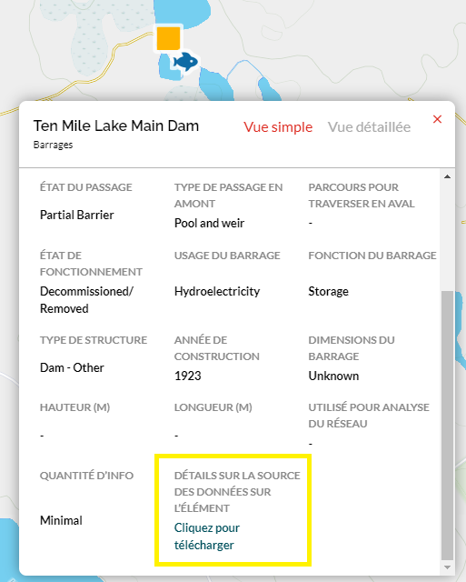
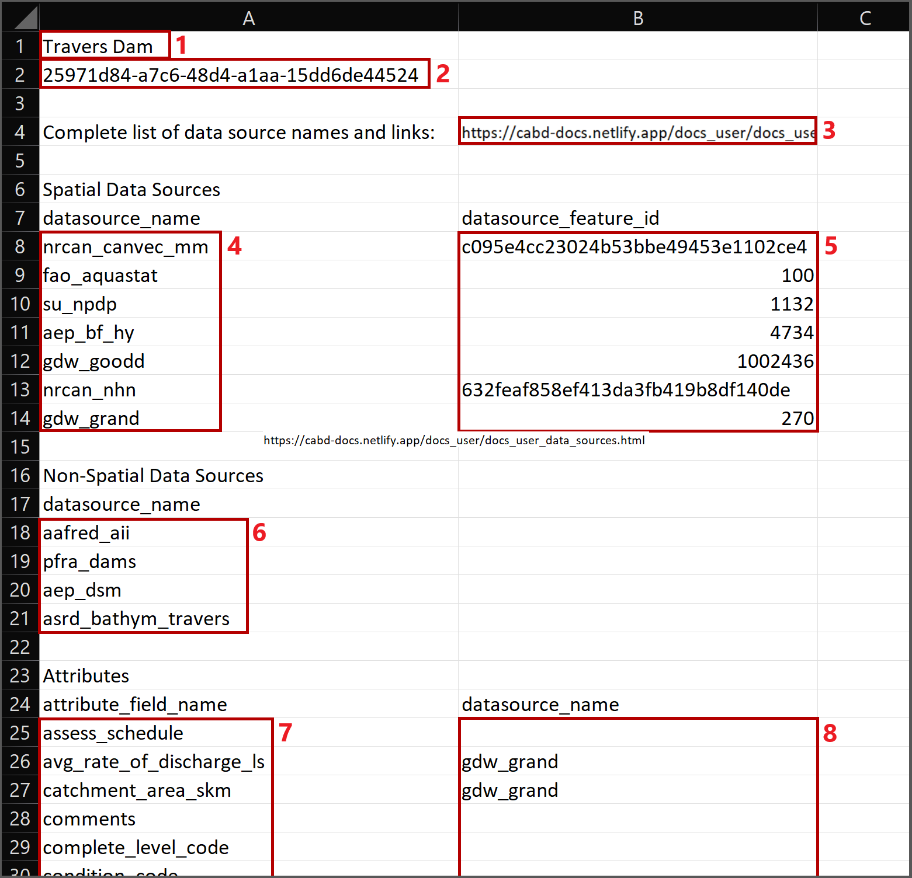

.. _data-source-details:

========================================================================
Téléchargement des détails sur la source des données sur l’élément
========================================================================

Pour tenir compte de la cartographie complexe des attributs nécessaire pour alimenter la BDOAC (divers attributs d’une même structure peuvent provenir de différentes sources des données), nous avons mis en place un lien sous **Détails sur la source des données sur l’élément** dans la case contextuelle des attributs (mis en évidence par la case jaune dans l’image ci-dessous) qui vous permet de télécharger un tableau CSV avec tous les renseignements sur les sources des données disponibles pour un point de données particulier. Vous pouvez y accéder au moyen de `l’outil Web <https://aquaticbarriers.ca/fr>`_ ou en soumettant une demande API au  :ref:`point de fin de la source des données des éléments <feature-datasource-endpoint>`.

Contenu CSV
-----------

-----

L’image ci-dessous est un exemple de tableau CSV des sources des données. Les cases rouges numérotées correspondent aux descriptions énumérées ci-dessous.

1. Le nom de la structure (s’il est connu).

2. L’identifiant unique d’obstacle ou de système (cabd_id) de la structure.
	
3. Le lien vers la page `Sources des données <https://cabd-docs-fr.netlify.app/docs_user/docs_user_data_sources.html>`_ qui contient les renseignements d’attribution pour les données contenues dans la base de données.
    
   .. admonition:: Remarque
       
       Vous pouvez recouper les noms abrégés des sources des données dans le document CSV (cases 4, 6 et 8) avec les renseignements de la page `Sources des données <https://cabd-docs-fr.netlify.app/docs_user/docs_user_data_sources.html>`_ afin de déterminer le nom complet et les renseignements de référence de chaque source de données.
	
4. La liste des sources des données spatiales qui contiennent un point correspondant pour la structure.

5. La liste des identifiants uniques associés au nom de la source de données figurant dans la même rangée du tableau. Cet identifiant unique correspond à l’élément dans la source de données répertoriée, et les renseignements sur les attributs pertinents pour la structure ont été reportés dans la BDOAC.

6. La liste des sources des données non spatiales utilisées pour la saisie des renseignements sur les attributs de la structure.

7. La liste des attributs disponibles dans la BDOAC pour le type d’élément sélectionné.

8. La liste des sources des données représentant l’ensemble de données utilisé pour la saisie des renseignements de l’attribut.