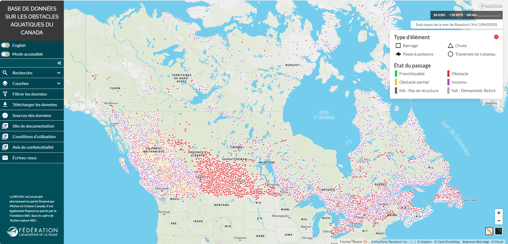

.. _web-tool:

=================
L’outil Web BDOAC
=================

.. toctree::
    :maxdepth: 3
    :hidden:

    docs_user_web_map/docs_user_web_map_tutorial_components
    docs_user_web_map/docs_user_web_map_tutorial_search
    docs_user_web_map/docs_user_web_map_tutorial_data_vis
    docs_user_web_map/docs_user_web_map_tutorial_attributes
    docs_user_web_map/docs_user_web_map_tutorial_filters
    docs_user_web_map/docs_user_web_map_tutorial_download
    docs_user_web_map/docs_user_web_map_tutorial_sources
    docs_user_web_map/docs_user_web_map_tutorial_docs
    docs_user_web_map/docs_user_web_map_tutorial_contact

L’outil Web BDOAC est une carte Web accessible au public qui permet aux utilisateurs d’explorer, de visualiser et de télécharger facilement les données de la Base de données sur les obstacles aquatiques du Canada (BDOAC).

Vous pouvez accéder à l’outil Web BDOAC au https://aquaticbarriers.ca/fr.

.. _tutorials:

Explorez les rubriques ci-dessous pour en savoir plus sur les composants et les fonctionnalités de l’outil Web :

* :ref:`Composants d’interface <components>`
* :ref:`Recherche <searching>`
* :ref:`Visualisation des données <visualizing>`
* :ref:`Consultation des renseignements sur les attributs <attributes>`
* :ref:`Filtrage des données <filtering>`
* :ref:`Téléchargement des données <downloading>`
* :ref:`Sources des données <data-sources>`
* :ref:`Site de documentation <docs>`
* :ref:`Nous joindre <contact>`