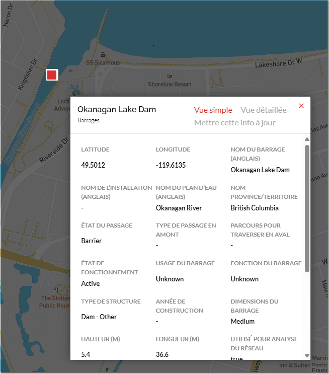

.. _attributes:

=================================================
Consultation des renseignements sur les attributs
=================================================

Pour voir les renseignements relatifs aux attributs d’une structure, cliquez simplement sur son point dans l’espace cartographique et la fenêtre contextuelle des attributs s’affichera.

.. raw:: html

    <video controls width="600"><source src="../../_static/viewing_attribute_data.mp4"></video>

Le nom de la structure est indiqué dans le coin supérieur gauche de cette fenêtre. Les deux boutons situés à droite du nom de la structure vous permettent de basculer entre la vue simple (liste abrégée des principaux attributs) et la vue détaillée (liste de tous les attributs disponibles pour le type d’élément).

Téléchargement des renseignements sur la source des données
-----------------------------------------------------------

Au bas de la vue simple et de la vue détaillée, vous trouverez un lien sur lequel vous pouvez cliquer pour télécharger une liste des sources des données dont sont tirés les renseignements sur les attributs de la structure. Les renseignements seront téléchargés au format CSV.

Veuillez consulter la section `Téléchargement des détails sur la source des données sur l’élément <https://cabd-docs-fr.netlify.app/docs_user/docs_user_data_sources/docs_user_data_sources_csv_download.html#csv-contents>`_ du site de documentation BDOAC pour en savoir plus sur le contenu du tableau CSV.

.. raw:: html

    <video controls width="600"><source src="../../_static/downloading_data.mp4"></video>