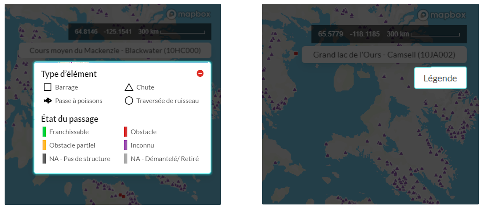

.. _components:

======================
Composants d’interface
======================

L’interface utilisateur se compose de trois éléments principaux :

#. la fenêtre d’affichage de la carte;
#. la légende;
#. le panneau de gauche.

Fenêtre d’affichage de la carte
~~~~~~~~~~~~~~~~~~~~~~~~~~~~~~~

L’espace cartographique est la zone permettant de visualiser les données.

Vous pouvez effectuer un zoom avant ou arrière sur l’espace cartographique de trois manières différentes : en utilisant le bouton de défilement de votre souris, en faisant glisser deux de vos doigts sur votre pavé tactile ou en cliquant sur les boutons + et - situés dans le coin inférieur droit de l’espace cartographique.

Sous les boutons de zoom, vous trouverez deux autres boutons permettant de basculer entre la carte de base (à gauche) et l’imagerie satellite (à droite).

.. figure:: img/mv_buttons.png
    :align: left
    :width: 90%

Légende
~~~~~~~

Une légende définit la symbologie des données.

On définit le type d’élément (barrage, chute ou passe à poissons) qu’un point de données représente au moyen de la forme, et on définit l’état du passage de l’élément au moyen de la couleur. Si vous avez de la difficulté à distinguer les couleurs, vous pouvez visualiser les données en mode accessibilité. Consultez la rubrique :ref:`Visualisation des données <visualizing>` pour en savoir plus.

Pour gagner de l’espace dans la fenêtre de visualisation de la carte, vous pouvez réduire la fenêtre de la légende en cliquant sur le cercle rouge dans son coin supérieur droit. Pour restaurer la fenêtre de la légende, cliquez simplement sur le bouton « légende ».

.. raw:: html

    <video controls width="600"><source src="../../_static/Legend.mp4"></video>

Panneau de gauche
~~~~~~~~~~~~~~~~~

Le panneau de gauche permet d’accéder à l’essentiel des fonctionnalités de l’outil Web.

Cela inclut les fonctionnalités suivantes :

* :ref:`Recherche d’un endroit ou d’une structure en particulier <searching>`
* :ref:`Visualisation des données dans la fenêtre de la carte <visualizing>`
* :ref:`Filtrage des données en fonction d’un ensemble de critères <filtering>`
* :ref:`Téléchargement des données <downloading>`

Les autres onglets du panneau vous permettront d’accéder au :ref:`site de documentation de la BDOAC <docs>` afin que vous puissiez explorer les :ref:`sources des données <data-sources>` utilisées, passer en revue la documentation technique et plus encore.
