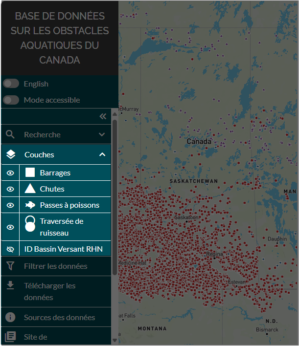

.. _visualizing:

=========================
Visualisation des données
=========================

Lors du chargement initial de l’outil Web dans la fenêtre de votre navigateur, toutes les couches d’élément (barrages, chutes et passes à poissons) à l’échelle du Canada seront affichées par défaut, à l’exception de la couche des limites de bassin versant du Réseau hydrographique national (RHN), qui est désactivée.

Pour modifier la visibilité des couches de données, accédez à l’onglet « couches » dans le panneau de gauche et cliquez sur l’icône d’œil.

.. raw:: html

    <video controls width="600"><source src="../../_static/visualizing_data.mp4"></video>

Mode accessibilité
------------------

Au bas du panneau des couches, vous trouverez un bouton de basculement « mode accessible ». Si vous activez le mode accessibilité, la symbologie des couleurs utilisée pour définir l’état du passage d’une structure sera remplacée par des symboles de caractères. Ce mode peut être utile si vous avez de la difficulté à discerner les couleurs.

.. figure:: img/accessibility_mode_all_highlight_fr.png
    :align: left
    :width: 90%

.. raw:: html

    <video controls width="600"><source src="../../_static/accessibility.mp4"></video>