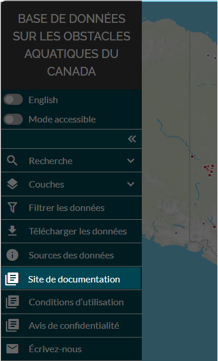

.. _docs:

=====================
Site de documentation
=====================
 
Vous pouvez accéder au site de documentation de la BDOAC en cliquant sur l’onglet « site de documentation » dans le panneau de gauche.

    

Le site de documentation de la BDOAC contient des ressources et des documents techniques offrant de plus amples renseignements sur l’outil Web de la BDOAC, les données contenues dans la BDOAC et l’architecture de la base de données.

.. raw:: html

    <video controls width="600"><source src="../../_static/documentation_site.mp4"></video>