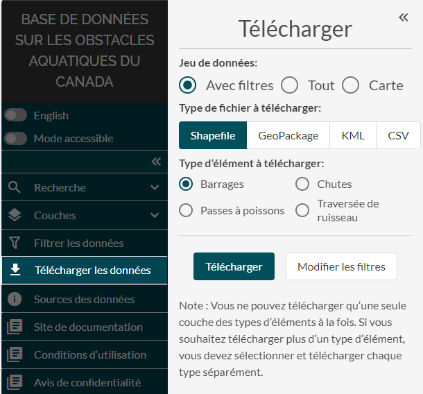

.. _downloading:

==========================
Téléchargement des données
==========================

Vous pouvez télécharger les données en ouvrant la fenêtre « télécharger ». Pour ouvrir cette fenêtre, cliquez sur le bouton « télécharger les données » dans la fenêtre « filtres » ou accédez à l’onglet « télécharger des données » dans le panneau de gauche.

Trois options s’offrent à vous pour le téléchargement des données :

1. téléchargement de vos résultats filtrés;
2. téléchargement des données actuellement affichées dans votre fenêtre de vue cartographique (ensemble de points filtrés que vous pouvez voir dans la vue cartographique actuelle);
3. téléchargement de toutes les données disponibles couche par couche.

Une fois que vous avez choisi un type d’ensemble de données, vous pouvez sélectionner le type de fichier pour l’exportation des données en cliquant sur le bouton « Shapefile », « Geopackage », « KML » ou « CSV ».

Si vous téléchargez toutes les données, vous devrez sélectionner la couche pour laquelle vous souhaitez obtenir les données. Si vous souhaitez télécharger toutes les données pour plusieurs couches, vous devrez télécharger les données de chaque couche séparément.

Au cours de ce processus, vous pouvez naviguer dans la vue cartographique pendant que la fenêtre de téléchargement est ouverte. Pour modifier les filtres appliqués aux données, vous pouvez cliquer sur le bouton « modifier des filtres ».

.. raw:: html

    <video controls width="600"><source src="../../_static/downloading_csv.mp4"></video>