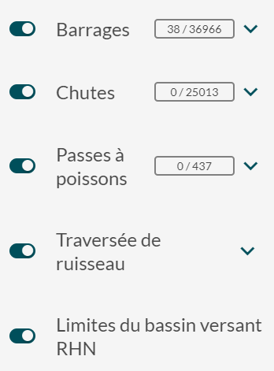
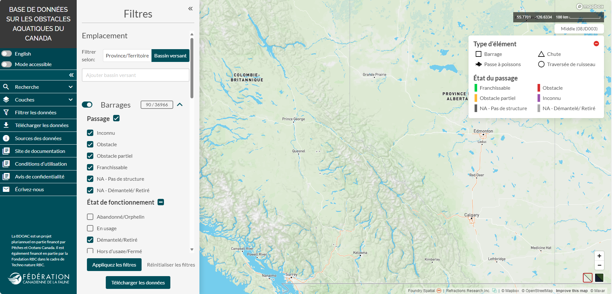

.. _filtering:

====================
Filtrage des données
====================

Pour filtrer les données en fonction d’un ensemble de critères, ouvrez la fenêtre « filtres » en cliquant sur l’onglet « filtrer les données » dans le panneau de gauche.

Filtrage par emplacement
------------------------

En fonction de votre domaine d’intérêt, les données peuvent être filtrées par province/territoire ou par bassin versant.

Pour ajouter la zone qui vous intéresse au filtre, il vous suffit de la sélectionner dans la liste déroulante ou de taper son nom dans la zone de texte. La liste déroulante sera filtrée en fonction du nom partiel ou complet d’une province, d’un territoire ou d’un bassin versant entré dans la zone de texte. Cliquez sur un nom pour l’ajouter aux critères de filtrage.

Le système ajoute chaque nouvelle sélection à la zone de texte de façon à créer une liste de critères de filtrage. Si une zone précédemment sélectionnée doit être supprimée de la liste, cliquez sur le x à droite de l’entrée.

Outre la méthode ci-dessus, vous pouvez ajouter des bassins versants au filtre en cliquant sur la vue cartographique.

Pour ce faire, vous devez activer la couche des limites de bassin versant du RHN située dans l’onglet « couches » du panneau de gauche. Faites un zoom avant sur l’emplacement de votre choix et cliquez sur le bassin versant qui englobe votre zone d’intérêt. Une fois que vous aurez cliqué sur un bassin versant, sa limite deviendra rouge et le nom sera ajouté à la zone de texte du filtre. Pour supprimer un bassin versant sélectionné de la liste de la zone de texte, cliquez sur le x situé à côté de l’entrée, tel qu’il est indiqué ci-dessus, ou cliquez une deuxième fois sur le bassin versant dans la vue cartographique de façon à le désélectionner.

.. admonition:: Remarque
    
    Les données ne peuvent être filtrées que par province et territoire ou par bassin versant. Vous pouvez faire une sélection pour chacune de ces deux options, mais seuls les critères dans la fenêtre active seront utilisés pour le filtrage des données.

.. raw:: html

    <video controls width="600"><source src="../../_static/filter_by_province.mp4"></video>
    
.. raw:: html

    <video controls width="600"><source src="../../_static/filter_by_watershed.mp4"></video>

Filtrage par attribut
---------------------

Sous les options de filtrage par emplacement, vous trouverez des options permettant de filtrer chaque type d’élément en fonction d’une liste prédéfinie d’attributs.

Pour exclure un type d’élément entier du filtrage, vous pouvez le désactiver en cliquant sur le bouton de basculement situé à gauche, dans la fenêtre « filtres ».

    Ici, nous avons appliqué des filtres de façon à ce que seules les données relatives aux barrages soient affichées.

Pour afficher les attributs filtrables d’un type d’élément, agrandissez la section et sélectionnez des critères parmi les options disponibles. La case située à droite de chaque nom d’attribut permet de réinitialiser toutes les cases des valeurs énumérées en dessous. Si une valeur d’attribut est cochée, tous les éléments qui contiennent cette valeur dans la base de données s’afficheront dans la fenêtre de vue cartographique une fois que vous aurez cliqué sur le bouton « appliquez les filtres ». Si une valeur d’attribut n’est pas cochée, tous les éléments qui contiennent cette valeur seront omis des résultats et ils ne seront pas affichés dans la fenêtre de vue cartographique.

    Filtrage des barrages de façon à ce que seules les structures ayant été mises hors service ou retirées soient affichées

.. raw:: html

    <video controls width="600"><source src="../../_static/filter_by_attribute.mp4"></video>

Boutons « appliquez les filtres », « réinitialiser les filtres » et « télécharger les données »
-----------------------------------------------------------------------------------------------

Vous devez cliquer sur le bouton d’application des filtres pour appliquer les filtres et afficher les résultats filtrés dans la vue cartographique. Si vous décidez de modifier votre sélection après l’application des filtres, vous devrez cliquer à nouveau sur le bouton d’application des filtres pour que la modification soit appliquée.

Pour effacer tous les filtres sélectionnés et rétablir les valeurs par défaut de la fenêtre « filtres », cliquez sur le bouton « réinitialiser les filtres ». Cette action est irréversible.

Une fois les données filtrées, vous pourrez télécharger les résultats en cliquant sur le bouton « télécharger les données », ce qui ouvrira la fenêtre de téléchargement des données (consultez la rubrique :ref:`Téléchargement des données <downloading>` pour en savoir plus).