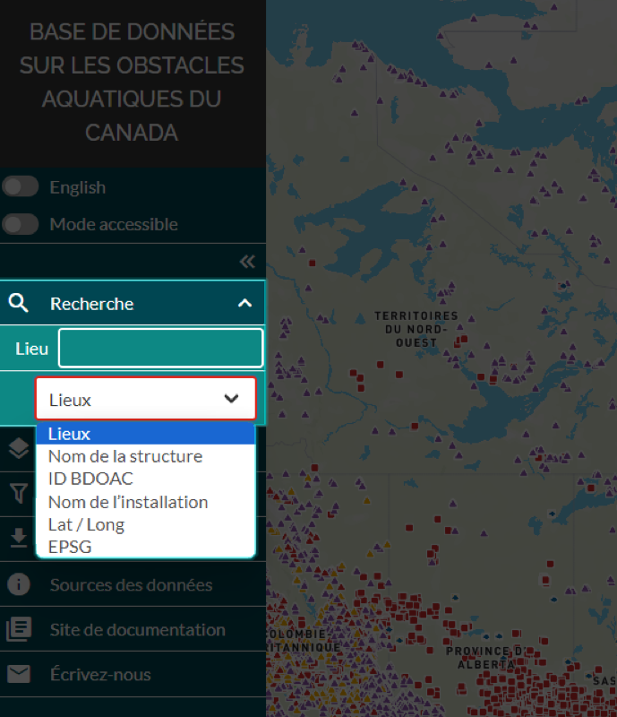

.. _searching:

=========
Recherche
=========

L’onglet « recherche » est le premier onglet du panneau de gauche.

Vous pouvez choisir de rechercher un emplacement ou une structure de différentes manières :

1. **Lieux :** permet de trouver un emplacement géographique au moyen de son nom

    .. figure:: img/place_search_fr.png
        :align: left
        :width: 60%

2. **Nom de la structure :** permet de trouver une structure au moyen de son nom

    .. figure:: img/structure_search_fr.png
        :align: left
        :width: 60%

3. **ID BDOAC :** permet de trouver une structure au moyen de son numéro d’identification BDOAC (par exemple, numéro d’identification d’obstacle ou de système indiqué dans la fenêtre contextuelle « attributs »)

    .. figure:: img/cabd_search_fr.png
        :align: left
        :width: 60%

4. **Lat/Long :** permet de trouver un emplacement géographique au moyen de valeurs de latitude et de longitude
  
    .. figure:: img/lat_search_fr.png
        :align: left
        :width: 60%

5. **EPSG :** permet de trouver un emplacement géographique au moyen de coordonnées x et y correspondant à un code EPSG.
  
    .. figure:: img/epsg_search_fr.png
        :align: left
        :width: 60%

.. raw:: html

    <video controls width="600"><source src="../../_static/Search.mp4"></video>