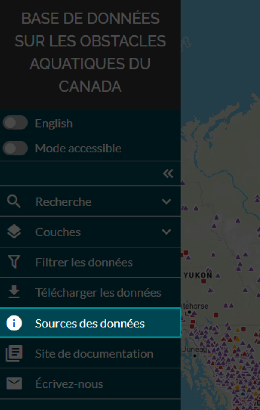
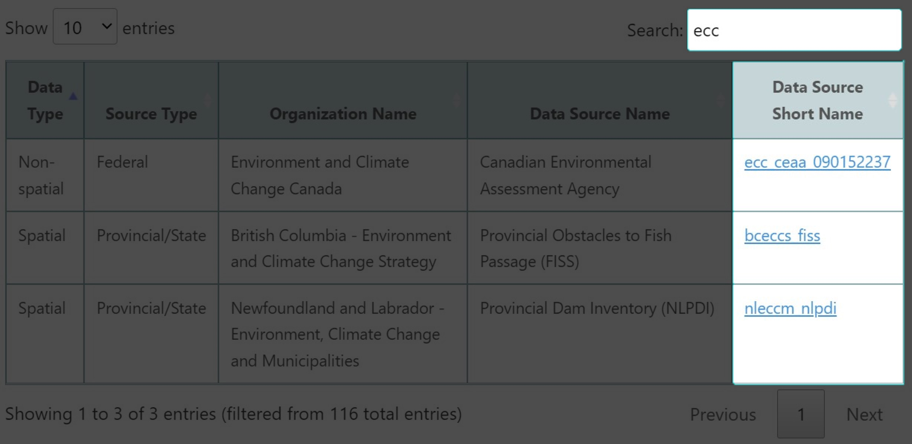

.. _sources:

===================
Sources des données
===================

Vous pouvez accéder aux renseignements sur toutes les sources des données spatiales et non spatiales à l’onglet « sources des données » dans le panneau de gauche. La page « sources des données » du site de documentation de la BDOAC s’ouvrira dans un nouvel onglet de votre navigateur lorsque vous cliquerez sur le bouton prévu à cette fin.

La page « sources des données » contient un tableau dans lequel vous pouvez effectuer des recherches au moyen du champ situé en haut à droite du tableau. Le champ « Data Source Short Name » contient des valeurs hyperliées qui vous permettront d’obtenir des renseignements plus détaillés sur la source de données si vous cliquez dessus.

Vous pouvez comparer les noms abrégés de source de données figurant dans ce tableau aux valeurs fournies dans les colonnes datasource_name du fichier CSV « Détails sur la source des données sur l'élément ». `Cliquez ici pour en savoir plus <https://cabd-docs-fr.netlify.app/docs_user/docs_user_data_sources/docs_user_data_sources_csv_download.html#csv-contents>`_.

.. raw:: html

    <video controls width="600"><source src="../../_static/data_sources.mp4"></video>